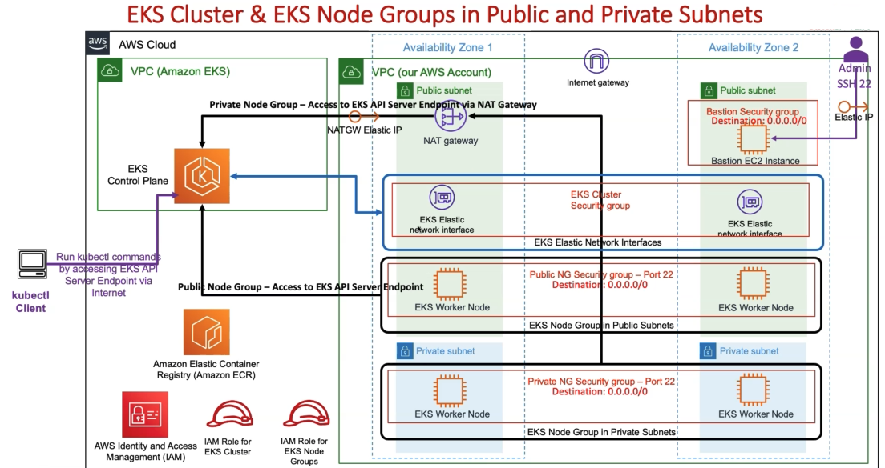

# aws-terraform-labs
# ☁️ Cloud & DevOps Labs

This repository contains my daily hands-on AWS, Terraform, Kubernetes and DevOps practice projects.
The goal of this repository is to improve my real-world infrastructure knowledge by continuously building and expanding cloud environments step by step and achieveing the AWS SA exam.

This is an active learning repository where new labs, experiments and infrastructure components are added regularly.

# Architecture Diagram

---

# 🚀 Technologies

* AWS
* Terraform
* Kubernetes
* Amazon EKS
* EC2
* IAM
* VPC
* Docker
* Linux / Bash
* YAML

---

# Repository Goals

This repository focuses on learning and practicing:

* Infrastructure as Code (IaC)
* AWS Cloud Architecture
* Kubernetes administration
* EKS cluster management
* IAM & security concepts
* Cloud networking
* DevOps workflows
* Infrastructure automation

---

# Current Architecture Direction

The infrastructure in this repository is designed around a realistic AWS Kubernetes environment using Amazon EKS.

The architecture includes:

* Custom AWS VPC
* Public & Private Subnets
* Bastion Host access
* EKS Cluster
* EKS Worker Nodes
* IAM Roles
* NAT Gateway
* Security Groups
* Kubernetes networking components

---

# 🔐 Why Bastion Hosts?

This repository includes Bastion Host architecture for learning purposes.

Historically, Bastion Hosts were commonly used to securely access infrastructure inside private networks.

Even though modern environments often prefer:

* AWS Systems Manager Session Manager
* Zero Trust access models
* VPN-based administration

understanding Bastion architecture is still important because many production environments continue to use this approach.

---

# Why Amazon EKS?

Amazon EKS is AWS's managed Kubernetes service.

Instead of manually managing Kubernetes control plane components, AWS handles:

* Kubernetes API Server
* etcd management
* High availability
* Cluster maintenance
* Scaling and updates

This allows engineers to focus more on infrastructure design and workloads.

---

# Why IAM Roles?

IAM Roles are critical for secure communication between AWS services and Kubernetes components.

Examples include:

* Worker nodes accessing AWS APIs
* Kubernetes controllers managing cloud resources
* Storage drivers interacting with EBS volumes
* Secure pod permissions using IRSA

Using IAM Roles helps avoid exposing long-term AWS credentials.

---

# Learning Philosophy

I prefer learning by:

* Building real infrastructure
* Practicing step by step
* Deploying cloud environments
* Breaking and fixing systems
* Writing Infrastructure as Code
* Continuously improving architecture designs

This repository grows daily as part of my long-term Cloud & DevOps engineering journey.

---

# Planned Topics

Future additions may include:

* IRSA (IAM Roles for Service Accounts)
* EBS CSI Driver
* Helm
* ArgoCD
* GitHub Actions
* CI/CD Pipelines
* Monitoring & Logging
* Prometheus & Grafana
* Terraform Modules
* Multi-Environment Deployments
* Production-style Kubernetes architectures
